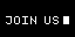

# 🐬 | Flipper Zero FSociety Asset Pack
## ℹ️ | Introduction
This is a custom asset pack that i built for my flipper zero, it provides a clean and tidy look for your flipper with the theme of hacking.
> [!NOTE]
> This asset pack is being worked on and i will add more in the future (Maybe)
## ✅ | Installation
> [!TIP]
> Want to take a look before installing the pack on your flipper? Check the section [below](#--animations).
- **Momentum firmware**: [FSociety.zip](https://github.com/Radioactiverm/flipper-fsociety-asset-pack/blob/main/FSociety.zip)
    1. Copy the directory `FSociety/` from the extracted .zip and paste the folder inside `SD Card/asset_packs`
    2. Open `Momentum` > `Interface` > `Graphics` and select `FSociety` in `Asset Pack`
## 👀 | Showcase

### ✨ | Animations

<table style="width: 100%; table-layout: fixed; margin: 0; padding: 0;">
    <tr align="center">
        <td style="width: 33%; padding: 0;">
            
        </td>
        <td style="width: 33%; padding: 0;">
            
        </td>
        <td style="width: 33%; padding: 0;">
            
        </td>
    </tr>
    <tr align="center">
        <td style="padding: 0;">
            ER404
        </td>
        <td style="padding: 0;">
            ERRORRRR
        </td>
        <td style="padding: 0;">
            FSociety
        </td>
    </tr>
    <tr align="center">
        <td style="width: 33%; padding: 0;">
            
        </td>
        <td style="width: 33%; padding: 0;">
            
        </td>
        <td style="width: 33%; padding: 0;">
            
        </td>
    </tr>
    <tr align="center">
        <td style="padding: 0;">
            Globe
        </td>
        <td style="padding: 0;">
            Join Us
        </td>
        <td style="padding: 0;">
            Kitty
        </td>
    </tr>
    <tr align="center">
        <td colspan="3" style="padding: 0;">
            
        </td>
    </tr>
    <tr align="center">
        <td colspan="3" style="padding: 0;">
            Moustage Man
        </td>
    </tr>
</table>

> [!WARNING]
> Forgot to mention that there are some animations taken from DarkMode asset pack that i forgot to showcase!

 > Repo strongly inspired by: **[@cyberartemio](https://github.com/cyberartemio/flipper-pirates-asset-pack)**
